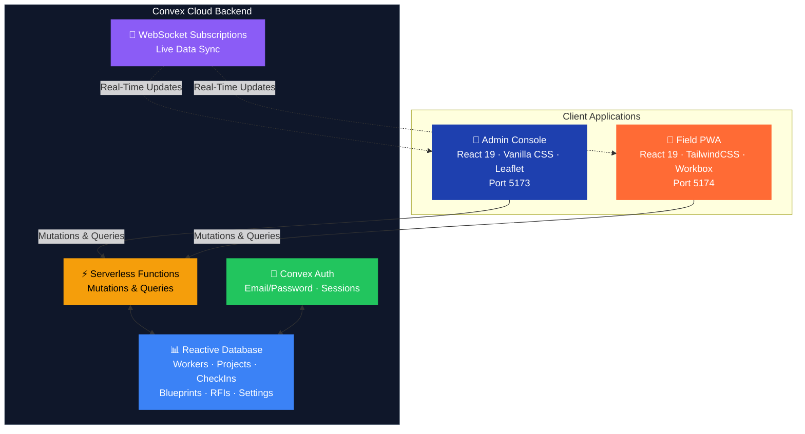

<p align="center">
  
</p>

<h1 align="center">MEPac — MEP Contracting & Field Workforce Management Platform</h1>

<p align="center">
  <em>Built for <strong>Focus MEP Solution</strong> · Engineered by <strong>RiverrTech</strong> · Powered by <strong>Antigravity AI</strong></em>
</p>

<p align="center">
  
  
  
  
  
</p>

---

## Table of Contents

- [Overview](#overview)
- [The Core Business Problem](#the-core-business-problem)
- [AI-Assisted Development Workflow](#ai-assisted-development-workflow)
- [Architecture & Ecosystem](#architecture--ecosystem)
- [Technology Stack](#technology-stack)
- [Key Features](#key-features)
- [User Roles & Access Matrix](#user-roles--access-matrix)
- [Project Structure](#project-structure)
- [Getting Started](#getting-started)
- [Environment Variables](#environment-variables)
- [Available Scripts](#available-scripts)
- [Team — RiverrTech](#team--riverrtech)
- [License](#license)

---

## Overview

**MEPac** (MEP Access & Control) is a full-stack, dual-application management platform purpose-built for MEP (Mechanical, Electrical & Plumbing) contracting operations. It pairs a comprehensive **Admin Web Console** with an offline-capable, mobile-first **Field Progressive Web Application (PWA)**, both driven by a shared reactive **Convex Cloud** backend.

The platform follows a **Management by Exception** philosophy: the interface stays clean and unobtrusive during normal operations but immediately surfaces GPS verification failures, proxy attendance anomalies, blueprint revision conflicts, and unresolved RFIs — so managers can act on what matters instead of hunting for problems.

| Application | Purpose | Port |
|---|---|---|
| **Admin Console** (`mepac-admin`) | Central operations dashboard for project managers and company executives | `5173` |
| **Field PWA** (`mepac-pwa`) | Mobile-first app for technicians, foremen, supervisors, and designers on-site | `5174` |
| **Convex Cloud** | Shared real-time serverless backend with reactive database subscriptions | Cloud |

---

## The Core Business Problem

### Client: Focus MEP Solution

**Focus MEP Solution** is an electrical engineering and MEP contracting company managing multiple concurrent construction sites across varying geographies. Before MEPac, the company faced a persistent, revenue-impacting operational challenge:

> **"How do we prove — with irrefutable evidence — that our field supervisors and technicians are physically present at assigned construction sites?"**

In the MEP contracting industry, accountability is not optional. Clients demand proof of attendance, and projects span environments with unreliable cellular connectivity, no Wi-Fi access, and extreme conditions. Paper-based sign-in sheets were easily forged. Phone-call check-ins were unverifiable. GPS tracking apps required constant connectivity that simply did not exist at many sites.

### What MEPac Solves

MEPac was designed from the ground up to answer this challenge with an **evidence-based, connectivity-resilient accountability system**:

1. **GPS-Geofenced Clock-In**: Every attendance action is validated against a project's geofence radius. The system captures latitude, longitude, accuracy, and timestamp at the moment of clock-in — creating a tamper-resistant record that proves physical presence.

2. **Offline-First PWA Shell**: The Field PWA caches its entire application shell via Workbox service workers. Field workers can open the app, review their assignments, and queue attendance actions even in zero-connectivity environments. Data syncs reactively when connectivity returns.

3. **Proxy Check-In Audit Trail**: When a worker cannot clock in themselves (dead phone, no network, app crash), a Foreman can perform an audited proxy check-in. These proxy records are flagged differently in the Admin Console and require explicit verification — closing the fraud loophole while preserving operational flexibility.

4. **Single-Device Session Enforcement**: Each worker can only be logged in on one device at a time. The system detects session conflicts in real time via Convex subscriptions and presents a blocking modal — preventing a supervisor from clocking in at the office while their phone is at the site.

5. **Real-Time Admin Visibility**: The Admin Console provides live dashboards with project health, attendance anomalies, workforce distribution, and silent-site alerts. Management does not need to wait for end-of-day reports — they see problems as they happen.

---

## AI-Assisted Development Workflow

### Built with Antigravity

MEPac was developed using **Antigravity**, an agent-first AI development platform by Google DeepMind. This was not a case of "AI writes everything" — it was a structured collaboration between human architects and AI sub-agents, each operating in their domain of strength.

### How the Workflow Operated

```
┌─────────────────────────────────────────────────────────────────┐
│                    HUMAN DECISION LAYER                         │
│  Product requirements · Architecture decisions · Debug cycles   │
│  Client interviews · Integration strategy · QA & deployment     │
└───────────────┬─────────────────────────────────┬───────────────┘
                │                                 │
                ▼                                 ▼
┌───────────────────────────┐   ┌───────────────────────────────┐
│   ANTIGRAVITY AGENTS      │   │   HUMAN IMPLEMENTATION        │
│                           │   │                               │
│  • React component gen    │   │  • Convex schema design       │
│  • TailwindCSS styling    │   │  • Frontend-backend bridge    │
│  • Boilerplate scaffolding│   │  • Complex state debugging    │
│  • Design system tokens   │   │  • Session enforcement logic  │
│  • Mock data generation   │   │  • Geofencing algorithms      │
│  • Documentation drafts   │   │  • Production deployment      │
└───────────────────────────┘   └───────────────────────────────┘
```

#### Phase 1: Requirement Translation → Prompts

Business requirements gathered during client discovery sessions with Focus MEP Solution were decomposed into modular, actionable prompts. For example, the client requirement *"Foremen should be able to mark attendance for workers whose phones are dead"* was translated into a series of prompts covering:
- A `ForemanCrew.jsx` component with crew attendance list and proxy modal
- A `checkIns.proxyCheckIn` Convex mutation with audit fields
- UI states for pending/verified proxy records in the Admin Attendance view

#### Phase 2: Agent-Orchestrated Generation

Antigravity's sub-agents generated React components, TailwindCSS-styled layouts, and Zustand store actions. Each generation cycle was reviewed by a human developer who:
- Verified component correctness against the Convex schema
- Ensured Convex `useQuery` subscriptions had proper skip conditions
- Corrected import paths and API endpoint references across the monorepo boundary

#### Phase 3: Human-Led Integration & Debugging

The most critical phase was entirely human-driven. AI agents excelled at generating isolated components and boilerplate, but the following required manual expertise:

- **Convex Schema Architecture**: Designing the relational model across `workers`, `projects`, `projectAssignments`, `checkIns`, `blueprintRevisions`, `rfis`, and `notifications` tables — including index strategies for real-time query performance.
- **Frontend-Backend Bridge**: Wiring the PWA's service layer (`authService.js`, `attendanceService.js`, `jobService.js`) to the Admin Console's Convex functions, ensuring both apps share the same backend contract.
- **Session Enforcement Logic**: Implementing the single-device lock required coordinating `currentSessionId` fields in the workers table, device-local UUIDs, Convex real-time subscriptions, and a blocking `SessionEnforcerModal` — a flow too stateful for any agent to get right end-to-end.
- **GPS Geofencing**: The adaptive location hook (`useAdaptiveLocation.js`) and geofence validation utilities (`geoUtils.js`) required careful tuning of accuracy thresholds, fallback tolerance, and mobile browser quirks that no prompt could fully specify.

### The Result

This hybrid workflow reduced the calendar time from concept to production deployment while maintaining the code quality required for a client-facing, accountability-critical platform. The AI accelerated surface-level work; the humans ensured the system actually worked under real-world conditions.

---

## Architecture & Ecosystem



### Data Flow

1. **Admin Console** and **Field PWA** share the same Convex deployment — every project, worker, check-in, and RFI is a single source of truth.
2. **Real-time subscriptions** (via `useQuery` from `convex/react`) ensure that when a technician clocks in on the PWA, the Admin's Attendance Log updates instantly without polling.
3. **The PWA's Zustand auth store** persists session state to `localStorage`, allowing the app to restore authentication across reloads without re-authenticating against Convex.

---

## Technology Stack

| Layer | Technology | Version | Role in MEPac |
|---|---|---|---|
| **UI Framework** | React | 19.2 | Component architecture for both Admin and PWA |
| **Routing** | React Router DOM | 7.18 | Nested role-based layouts and route guards (PWA) |
| **Admin Styling** | Vanilla CSS | — | Custom design system with IBM Plex Sans / Inter typography |
| **PWA Styling** | TailwindCSS | 3.4 | Utility-first mobile design with custom color tokens |
| **State Management** | Zustand | 5.0 | Persistent auth store with `localStorage` sync |
| **Backend / BaaS** | Convex | 1.42 | Real-time database, serverless functions, auth |
| **Authentication** | Convex Auth (`@convex-dev/auth`) | 0.0.94 | Email/password auth with invite-based admin onboarding |
| **Build Tool** | Vite | 8.1 | Dev server with HMR, production bundling, chunk splitting |
| **PWA Engine** | vite-plugin-pwa | 1.3 | Service worker generation, manifest, Workbox caching |
| **Maps & Geo** | Leaflet | 1.9 | Interactive project location picker with geofence radius overlay |
| **Icons** | Lucide React | 1.26 | Consistent SVG icon system across both apps |
| **Linting** | Oxlint | 1.71 | Fast JavaScript code quality checks |
| **Deployment** | Vercel | — | SPA hosting with client-side route rewrites |

---

## Key Features

### 🏢 Admin Web Console

| Module | Capabilities |
|---|---|
| **Dashboard** | Live KPIs for active projects, workforce on-site, attendance rates, and recent activity |
| **Projects Hub** | Create/edit/archive MEP projects with client metadata, GPS coordinates, and site images |
| **Project Detail** | Deep-dive view: assigned workers, project-specific blueprints, attendance, and RFIs |
| **Location Picker** | Interactive Leaflet map with click-to-place markers and adjustable geofence radius preview |
| **Workforce** | Global worker registry with role assignment, PIN management, multi-project allocation |
| **Attendance Log** | Daily check-in/out records with type tracking (Self / Proxy / Manual), status verification |
| **Drawings** | Multi-discipline blueprint vault with FIFO revision history (max 3 versions), version pinning |
| **RFIs & Disputes** | Ticket lifecycle management: OPEN → IN PROGRESS → FLAGGED → RESOLVED |
| **Settings** | Company profile, shift hours, GPS enforcement, geofence radius, work week, holidays |
| **Admin Management** | Owner-only: invite admins by email, revoke invitations, remove accounts |
| **Notifications** | Real-time notification panel with read/delete actions |

### 📱 Field Mobile PWA

| Capability | Details |
|---|---|
| **Adaptive GPS Clock-In** | Geofence-validated attendance with accuracy indicators and visual radius check |
| **Foreman Crew Hub** | Real-time crew status list, audited proxy check-in with reason selection |
| **Supervisor Dashboard** | Project overview, RFI creation, dispute logging with priority and project assignment |
| **Designer Blueprint Manager** | Multi-discipline drawing upload/revision with category dropdowns and version notes |
| **PIN Authentication** | Worker ID or mobile number + 6-digit PIN, with first-time PIN setup flow |
| **Single-Device Session Lock** | Real-time Convex subscription detects conflicting sessions, shows blocking modal |
| **Push Notifications** | Browser and service worker notifications for assignments, RFIs, and drawing updates |
| **Error Boundary** | Graceful error recovery preventing white-screen crashes in the field |
| **Offline PWA Shell** | Workbox-cached app shell, Google Fonts caching (1-year expiry), standalone display mode |

---

## User Roles & Access Matrix

| Role | Application | Home Route | Key Capabilities |
|---|---|---|---|
| **Owner** | Admin Console | Dashboard | Full platform control, admin user lifecycle management |
| **Admin** | Admin Console | Dashboard | Project, workforce, attendance, and RFI management |
| **Supervisor** | Field PWA | `/supervisor/home` | Multi-project oversight, RFI/dispute creation, site status |
| **Foreman** | Field PWA | `/foreman/home` | Crew attendance, proxy check-ins, daily task management |
| **Technician** | Field PWA | `/technician/home` | GPS clock-in/out, job details, personal attendance calendar |
| **Designer** | Field PWA | `/designer/projects` | Blueprint upload/revision, discipline filtering, version history |

---

## Project Structure

```
MEPac/
├── .gitignore
├── LICENSE                              # Proprietary — RiverrTech © 2026
├── README.md                            # ← You are here
├── package.json                         # npm workspaces: mepac-admin + mepac-pwa
│
├── mepac-admin/                         # 🏢 Admin Web Console
│   ├── convex/                          # ═══ Central Convex Backend ═══
│   │   ├── schema.js                    #   Database schema & table definitions
│   │   ├── auth.js                      #   Convex Auth configuration
│   │   ├── auth.config.js               #   Auth provider setup
│   │   ├── http.js                      #   HTTP router for auth endpoints
│   │   ├── adminUsers.js               #   Admin invite/RBAC lifecycle
│   │   ├── workers.js                   #   Workforce CRUD, login, session claims
│   │   ├── projects.js                  #   Project mutations & queries
│   │   ├── assignments.js               #   Many-to-many project ↔ worker links
│   │   ├── checkIns.js                  #   Attendance: clock-in/out, proxy, manual
│   │   ├── blueprints.js               #   Blueprint versioning & FIFO control
│   │   ├── rfis.js                      #   RFI/dispute ticket management
│   │   ├── notifications.js            #   Stakeholder notification generation
│   │   └── settings.js                  #   Company config singleton
│   ├── src/
│   │   ├── App.jsx                      #   Hash-based SPA router
│   │   ├── main.jsx                     #   Entry: Convex + Auth providers
│   │   ├── index.css                    #   Design system (38KB+)
│   │   ├── components/
│   │   │   ├── Layout/                  #   Sidebar, Topbar
│   │   │   ├── modals/                  #   All dialog modals
│   │   │   ├── auth/                    #   SessionLockModal
│   │   │   ├── notifications/           #   NotificationsPanel
│   │   │   ├── LocationPicker.jsx       #   Leaflet map + geofence
│   │   │   └── GeofencePreviewMap.jsx   #   Read-only geofence display
│   │   └── views/
│   │       ├── Dashboard.jsx
│   │       ├── ProjectsHub.jsx
│   │       ├── ProjectDetail.jsx
│   │       ├── Workforce.jsx
│   │       ├── AttendanceLog.jsx
│   │       ├── Drawings.jsx
│   │       ├── RFIs.jsx
│   │       ├── Settings.jsx
│   │       ├── ManageUsers.jsx
│   │       └── LoginPage.jsx
│   ├── vite.config.js                   #   Port 5173
│   └── vercel.json                      #   SPA rewrite rules
│
└── mepac-pwa/                           # 📱 Field Mobile PWA
    ├── docs/
    │   └── CODEBASE_DOCUMENTATION.md    #   Comprehensive architecture docs
    ├── public/                          #   PWA icons & favicon
    ├── src/
    │   ├── App.jsx                      #   Route definitions + ErrorBoundary
    │   ├── convex.js                    #   Convex client initialization
    │   ├── main.jsx                     #   Entry: Convex + BrowserRouter
    │   ├── components/
    │   │   ├── BottomNav.jsx            #   Floating pill-shaped mobile nav
    │   │   ├── PinInput.jsx             #   6-digit PIN entry
    │   │   ├── ErrorBoundary.jsx        #   Crash recovery wrapper
    │   │   ├── SessionEnforcerModal.jsx #   Single-device enforcement
    │   │   ├── NotificationDrawer.jsx   #   Slide-in notifications
    │   │   └── PushNotificationListener.jsx
    │   ├── layouts/                     #   TechnicianLayout, ForemanLayout,
    │   │                                #   SupervisorLayout, DesignerLayout
    │   ├── pages/
    │   │   ├── LoginPage.jsx            #   Shared login (ID/Mobile + PIN)
    │   │   ├── PinSetup.jsx             #   First-time PIN onboarding
    │   │   ├── AcceptInvite.jsx         #   Invitation flow
    │   │   ├── technician/              #   Home, Calendar, Account, Profile, ChangePin
    │   │   ├── foreman/                 #   Home, Crew, Calendar, Account, Profile, ChangePin
    │   │   ├── supervisor/              #   Home, Projects, ProjectDetail, RFIs, Account, Profile, ChangePin
    │   │   └── designer/               #   Projects, ProjectDrawings, Account, Profile, ChangePin
    │   ├── services/                    #   authService, attendanceService, jobService, pushNotificationService
    │   ├── store/authStore.js           #   Zustand + localStorage persistence
    │   ├── hooks/useAdaptiveLocation.js #   GPS with fallback handling
    │   ├── routes/ProtectedRoute.jsx    #   Auth + role guard
    │   └── utils/                       #   geoUtils.js, colors.js
    ├── tailwind.config.js               #   Design tokens
    ├── vite.config.js                   #   PWA + Workbox config, Port 5174
    └── vercel.json                      #   SPA rewrite rules
```

---

## Getting Started

### Prerequisites

- **Node.js** ≥ 18 — [nodejs.org](https://nodejs.org/)
- **npm** ≥ 9
- **Convex account** — [convex.dev](https://convex.dev/) (free tier works for development)

### Installation & Setup

```bash
# 1. Clone the repository
git clone https://github.com/Ibnujaleel/MEPac.git
cd MEPac

# 2. Install all workspace dependencies
npm install

# 3. Initialize Convex backend (follow CLI prompts)
npm run dev:convex

# 4. Start both applications concurrently
npm run dev
```

After running `npm run dev`:
- **Admin Console**: [http://localhost:5173](http://localhost:5173)
- **Field PWA**: [http://localhost:5174](http://localhost:5174)

### First-Time Admin Setup

The Owner account (`admin@riverrtech.com`) must be created first. This account has elevated privileges:
- Invite new administrators by email
- Revoke pending invitations
- Remove existing admin accounts

All other admin accounts are created via the invite flow — the Owner sends an email invite, and the recipient sets their password on first login.

---

## Environment Variables

Both apps require Convex endpoints in their respective `.env.local` files:

### `mepac-admin/.env.local`

```env
VITE_CONVEX_URL=https://<your-project>.convex.cloud
VITE_CONVEX_SITE_URL=https://<your-project>.convex.site
```

### `mepac-pwa/.env.local`

```env
VITE_CONVEX_URL=https://<your-project>.convex.cloud
VITE_CONVEX_SITE_URL=https://<your-project>.convex.site
```

> **Note**: `.env.local` files are git-ignored and will never be committed.

---

## Available Scripts

Run from the workspace root (`MEPac/`):

| Command | What It Does |
|---|---|
| `npm run dev` | Starts **both** Admin Console and Field PWA concurrently |
| `npm run dev:admin` | Starts Admin Console only → `http://localhost:5173` |
| `npm run dev:pwa` | Starts Field PWA only → `http://localhost:5174` |
| `npm run dev:convex` | Starts Convex backend dev watcher (schema push + function reload) |
| `npm run build` | Production builds for both applications |
| `npm run build:admin` | Production build for Admin Console |
| `npm run build:pwa` | Production build for Field PWA (includes SW generation) |
| `npm run lint` | Runs Oxlint across both packages |

---

## Team — RiverrTech

MEPac is designed, built, and maintained by **RiverrTech** — an independent development team.

| Member | Role | Ownership |
|---|---|---|
| **Alfaaz Abdul Jaleel Kuruniyan** | Product Manager & Integration Lead | Client discovery, ideation, requirement engineering, frontend-backend integration bridge, system architecture decisions |
| **Joel Benoy** | Backend & Admin Console Lead | Convex schema architecture, serverless mutation/query design, Admin Console UI and business logic |
| **Mohammad Afsal M** | Frontend PWA Developer | React component generation, PWA configuration, TailwindCSS design system, mobile UI/UX, role-specific page logic |
| **Amal Vinayan** | Deployment & Optimization Specialist | System performance tuning, live Convex integration testing, production deployment pipelines, build optimization |

---

## License

**Proprietary Software** — Copyright © 2026 RiverrTech. All Rights Reserved.

This software and its source code are the exclusive property of RiverrTech and its individual members. Unauthorized copying, distribution, modification, or commercial use is strictly prohibited without prior written consent.

See [`LICENSE`](./LICENSE) for complete terms.
