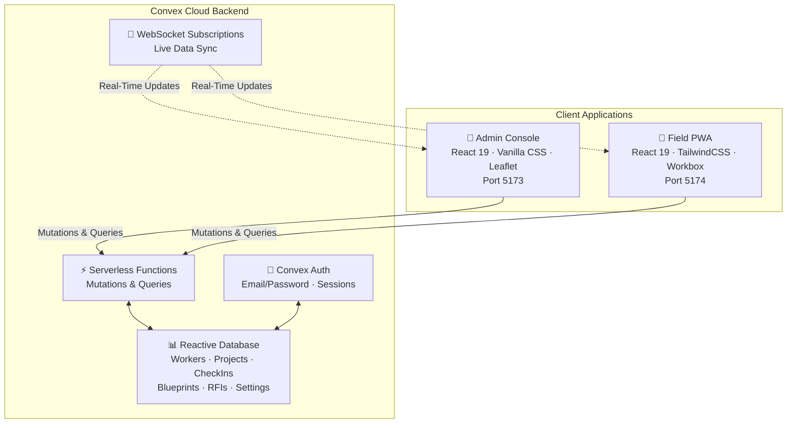
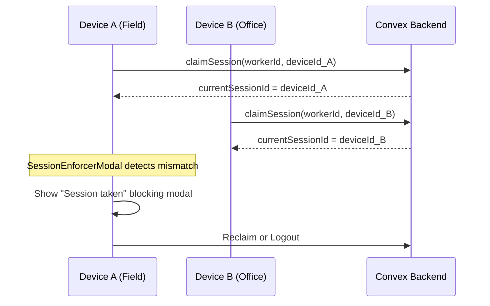

# MEPac — System Architecture

## High-Level Architecture



---

## Key Architectural Decisions

| Decision | Rationale |
|---|---|
| **Convex as BaaS** | Real-time subscriptions, serverless functions, managed database — no custom server infrastructure needed |
| **Single Convex deployment** | Both Admin Console and Field PWA share the same backend — every project, worker, and check-in is a single source of truth |
| **Zustand over Redux** | Minimal boilerplate for auth-only global state in the PWA |
| **Role-based nested routing** | Each PWA role gets its own layout shell and route group, enforced by `ProtectedRoute` |
| **Service layer abstraction** | All Convex API calls wrapped in service functions in the PWA, isolating backend coupling from UI components |
| **PWA with Workbox** | Enables install-to-homescreen, offline caching, and push notifications for field workers |
| **Single-device session enforcement** | One active login per worker across devices — critical for attendance integrity |
| **Hash-based routing (Admin)** | Avoids server-side routing configuration; the server serves one `index.html`, client handles navigation |

---

## Data Flow

1. **Admin Console** and **Field PWA** share the same Convex deployment — every project, worker, check-in, and RFI is a single source of truth.
2. **Real-time subscriptions** (`useQuery` from `convex/react`) ensure that when a technician clocks in via the PWA, the Admin's Attendance Log updates instantly without polling.
3. **The PWA's Zustand auth store** persists session state to `localStorage`, allowing the app to restore authentication across reloads without re-authenticating.
4. **File storage** flows through Convex Storage with pre-signed upload URLs — files never transit the application server.

---

## Technology Stack

| Layer | Technology | Version | Role in MEPac |
|---|---|---|---|
| **UI Framework** | React | 19.2 | Component architecture for both Admin and PWA |
| **Routing (Admin)** | Hash-based (`#view=...`) | — | SPA navigation without server routing config |
| **Routing (PWA)** | React Router DOM | 7.18 | Nested role-based layouts and route guards |
| **Admin Styling** | Vanilla CSS | — | Custom design system with CSS custom properties |
| **PWA Styling** | TailwindCSS | 3.4 | Utility-first mobile design with custom color tokens |
| **State Management** | Zustand | 5.0 | Persistent auth store with `localStorage` sync (PWA) |
| **Backend / BaaS** | Convex | 1.42 | Real-time database, serverless functions, auth |
| **Authentication** | Convex Auth | 0.0.94 | Email/password auth with invite-based admin onboarding |
| **Build Tool** | Vite | 8.1 | Dev server with HMR, production bundling, chunk splitting |
| **PWA Engine** | vite-plugin-pwa | 1.3 | Service worker generation, manifest, Workbox caching |
| **Maps & Geo** | Leaflet | 1.9 | Interactive project location picker with geofence radius overlay |
| **Icons** | Lucide React | 1.26 | Consistent SVG icon system across both apps |
| **Linting** | Oxlint | 1.71 | Fast JavaScript code quality checks |
| **Deployment** | Vercel | — | SPA hosting with client-side route rewrites |

---

## Admin Console Architecture

```
[Browser]
    │
    │  Loads React SPA (one HTML file)
    ▼
[React + Hash Router]
    │
    │  useQuery() / useMutation()
    │  over WebSocket (persistent, real-time)
    ▼
[Convex Platform]
    │
    ├── Queries (read, reactive) ────► [Document Database]
    └── Mutations (write, transactional) ► [Document Database]
```

### Admin Console Provider Stack (`main.jsx`)

```
ConvexAuthProvider
  └── ConvexProvider
       └── App (hash-based router)
```

---

## PWA Architecture

```
StrictMode
  └── ConvexProvider (real-time backend client)
       └── BrowserRouter (client-side routing)
            └── App (route definitions + ErrorBoundary)
```

The Convex client (`convex.js`) uses `anyApi` for dynamic function references without codegen. Auth state is managed by Zustand, persisted to `localStorage` under key `mepac_auth_session`.

---

## Single-Device Session Enforcement

Each worker can only be logged in on one device at a time.



`SessionEnforcerModal` subscribes to `workers.getActiveSession` (real-time Convex query), compares the server's `currentSessionId` with the local device ID, and shows a blocking modal with **Reclaim** or **Logout** options.
