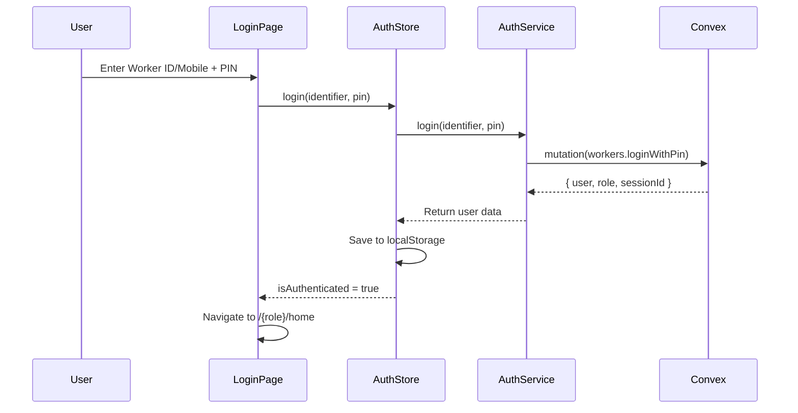
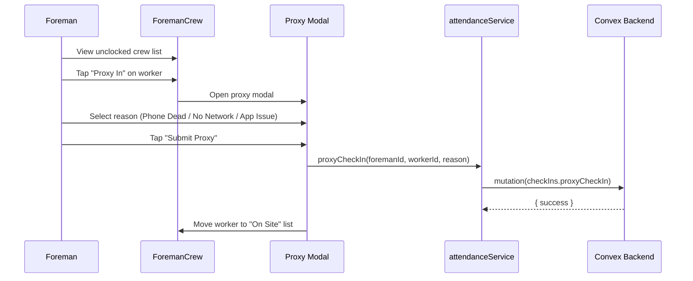
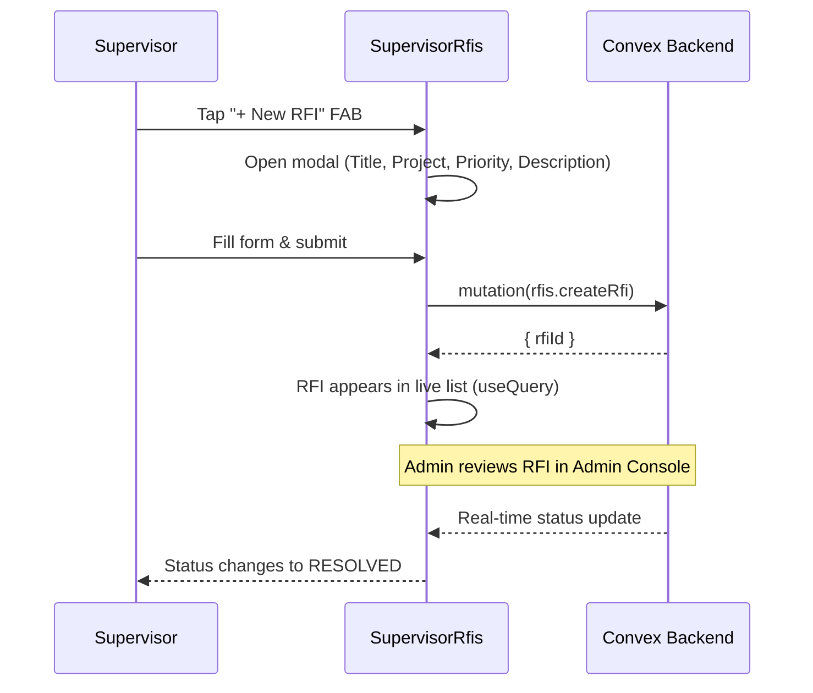
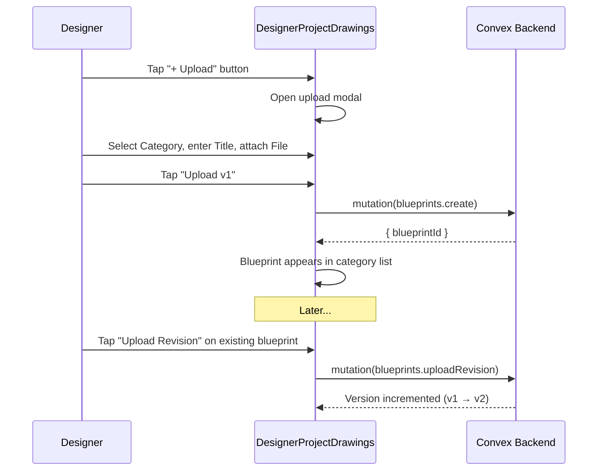

# MEPac — Field PWA

The Field PWA (`mepac-pwa`) is a mobile-first Progressive Web App for field workers. It is served at port `5174` and can be installed on any device via the browser's "Add to Home Screen" prompt.

---

## Authentication

Workers authenticate using their **Worker ID or mobile number** + a **6-digit PIN**.

### Login Flow



### Session Persistence

- Auth state persists to `localStorage` under key `mepac_auth_session`
- On reload, `authStore` reads from localStorage to restore the session
- Each device generates a unique `mepac_device_session_id` for session tracking

### First-Time PIN Setup

New workers set by the Admin Console arrive with an `adminPin` and `pinIsDefault: true`. On first login, they are redirected to `PinSetup.jsx` to create their own PIN before accessing any features.

---

## Role-Based Routing

`ProtectedRoute` guards each role group:
- **Not authenticated** → Redirect to `/login`
- **Wrong role** → Redirect to `/{actualRole}/home`
- **Authorized** → Render layout + page

### Route Map

| Route Pattern | Role | Layout | Pages |
|---|---|---|---|
| `/login` | Public | — | Login |
| `/accept-invite` | Public | — | Accept Invite |
| `/technician/*` | `technician` | TechnicianLayout | Home, Calendar, Account, Profile, Change PIN |
| `/foreman/*` | `foreman` | ForemanLayout | Home, Crew, Calendar, Account, Profile, Change PIN |
| `/supervisor/*` | `supervisor` | SupervisorLayout | Home, Projects, Project Detail, RFIs, Account, Profile, Change PIN |
| `/designer/*` | `designer` | DesignerLayout | Projects, Project Drawings, Account, Profile, Change PIN |
| `*` (catch-all) | — | — | Redirect to `/login` |

All role layouts follow the same structure: a full-height container with `<main>` rendering page content via `<Outlet />`, and a floating pill-shaped `<BottomNav>` at the bottom.

---

## User Roles & Features

### Technician (`/technician/*`)

| Page | Key Features |
|---|---|
| **Home** | GPS-geofenced clock-in/out, active job card, daily task list |
| **Calendar** | Monthly attendance calendar with day-by-day records |
| **Account** | Settings menu (profile, change PIN, logout) |
| **Profile** | View/edit personal details |
| **Change PIN** | Old PIN → New PIN → Confirm flow |

**Bottom Nav**: Home · Calendar · Account

---

### Foreman (`/foreman/*`)

| Page | Key Features |
|---|---|
| **Home** | GPS clock-in/out, crew overview, daily toolbox talk |
| **Crew** | Crew attendance list, audited proxy check-in modal with reason selection |
| **Calendar** | Monthly attendance calendar |
| **Account** | Settings menu |
| **Profile** | View/edit personal details |
| **Change PIN** | PIN change flow |

**Bottom Nav**: Home · Crew · Calendar · Account

#### Proxy Check-In Flow



---

### Supervisor (`/supervisor/*`)

| Page | Key Features |
|---|---|
| **Home** | Dashboard KPIs, project overview, crew stats, daily summary |
| **Projects** | Project list with status filters and search |
| **Project Detail** | Detailed project view with crew, tasks, and progress |
| **RFIs & Disputes** | RFI/Dispute hub with filters, threaded messages, dispute audit trail |
| **Account** | Settings menu |
| **Profile** | View/edit personal details |
| **Change PIN** | PIN change flow |

**Bottom Nav**: Home · Projects · RFIs · Account

#### RFI Creation Flow



---

### Designer (`/designer/*`)

| Page | Key Features |
|---|---|
| **Projects** | Assigned project list with gradient cards |
| **Project Drawings** | Blueprint manager — upload, revise, delete, version history |
| **Account** | Settings menu |
| **Profile** | View/edit personal details |
| **Change PIN** | PIN change flow |

**Bottom Nav**: Projects · Account

#### Blueprint Upload Flow



---

## GPS Geofencing

The `useAdaptiveLocation` hook manages GPS acquisition with intelligent fallbacks:

1. High-accuracy GPS requested first
2. If accuracy exceeds the geofence threshold, a lower-accuracy fallback is accepted with a visual warning
3. `geoUtils.js` calculates the haversine distance between the worker's position and the project's GPS coordinates
4. Clock-in is rejected if the worker is outside the geofence radius (configurable in Settings)

```
Worker position → haversine distance → compare to geofenceRadius → allow or block
```

---

## Offline & PWA Capabilities

Configured in `vite.config.js` using `vite-plugin-pwa`:

| Feature | Setting |
|---|---|
| **App Name** | MEPac — Field Workforce Management |
| **Display Mode** | `standalone` (full-screen, no browser chrome) |
| **Theme Color** | `#1E3A5F` |
| **Register Type** | `autoUpdate` (service worker auto-updates on new deployments) |
| **Offline Caching** | JS, CSS, HTML, images, fonts via Workbox `globPatterns` |
| **Font Caching** | Google Fonts cached for 1 year with `CacheFirst` strategy |

### Build Optimisation

Manual chunking splits vendor code into four bundles:
- `vendor-react` — React, React DOM, React Router
- `vendor-convex` — Convex client
- `vendor-icons` — Lucide React icons
- `vendor-libs` — All other node_modules

---

## Push Notifications

`PushNotificationListener` (mounted globally in `App.jsx`) subscribes to Convex notification queries and triggers browser notifications for new items. It uses the Service Worker route (`registration.showNotification()`) for mobile PWA, with a fallback to `new Notification()` for desktop browsers.

---

## State Management

Single Zustand store (`authStore.js`) for cross-cutting auth state. All component-level state (form inputs, modals, filters) uses React `useState` hooks.

| Field | Type | Description |
|---|---|---|
| `user` | `object \| null` | Current authenticated user |
| `role` | `string \| null` | User's role (`technician`, `foreman`, `supervisor`, `designer`) |
| `isAuthenticated` | `boolean` | Whether a session is active |
| `isLoading` | `boolean` | Loading state during auth operations |
| `error` | `string \| null` | Last auth error message |

**Actions:** `login(phone, pin, force?)`, `logout()`, `updateUser(updates)`, `clearError()`

**Persistence:** `localStorage` key `mepac_auth_session`

---

## Design System

Defined in `tailwind.config.js`:

| Token | Value | Usage |
|---|---|---|
| `primary` | `#1E40AF` | Primary buttons, active states, links |
| `primary-light` | `#3B82F6` | Hover states, lighter accents |
| `primary-dark` | `#00288E` | Bottom nav active tab background |
| `accent` | `#FF6B35` | Call-to-action highlights |
| `success` | `#22C55E` | Positive states (clocked in, resolved) |
| `warning` | `#F59E0B` | Caution states |
| `error` | `#EF4444` | Error states, disputes, high priority |
| `surface` | `#F8FAFC` | Page background |
| `surface-card` | `#FFFFFF` | Card backgrounds |
| `text-primary` | `#0B1C30` | Main body text |
| `text-secondary` | `#444653` | Supporting text |
| `text-muted` | `#6B7280` | Hint / placeholder text |

**Typography:**
- `Inter` — body text (font-sans)
- `IBM Plex Sans` — headings (font-heading)
- `JetBrains Mono` — monospace (font-mono)

---

## File Structure

```
mepac-pwa/
├── index.html
├── package.json
├── vite.config.js          # Vite + PWA + chunking config
├── tailwind.config.js      # Design tokens
├── postcss.config.js
├── vercel.json             # Vercel SPA rewrite rules
├── public/                 # Static assets (PWA icons, favicon)
└── src/
    ├── main.jsx            # App bootstrap (React root, providers)
    ├── App.jsx             # Route definitions + ErrorBoundary
    ├── convex.js           # Convex client initialization
    ├── index.css           # Global CSS + Tailwind directives
    ├── components/         # Shared reusable UI components
    │   ├── BottomNav.jsx
    │   ├── Button.jsx
    │   ├── Card.jsx
    │   ├── Input.jsx
    │   ├── Select.jsx
    │   ├── PinInput.jsx
    │   ├── ErrorBoundary.jsx
    │   ├── NotificationBellButton.jsx
    │   ├── NotificationDrawer.jsx
    │   ├── PushNotificationListener.jsx
    │   └── SessionEnforcerModal.jsx
    ├── layouts/            # Role-specific shell layouts
    │   ├── TechnicianLayout.jsx
    │   ├── ForemanLayout.jsx
    │   ├── SupervisorLayout.jsx
    │   └── DesignerLayout.jsx
    ├── pages/              # Page-level components (by role)
    │   ├── LoginPage.jsx
    │   ├── AcceptInvite.jsx
    │   ├── PinSetup.jsx
    │   ├── technician/
    │   ├── foreman/
    │   ├── supervisor/
    │   └── designer/
    ├── routes/
    │   └── ProtectedRoute.jsx
    ├── services/           # API service layer
    │   ├── authService.js
    │   ├── attendanceService.js
    │   ├── jobService.js
    │   └── pushNotificationService.js
    ├── store/
    │   └── authStore.js    # Zustand auth store
    ├── hooks/
    │   └── useAdaptiveLocation.js
    └── utils/
        ├── colors.js
        └── geoUtils.js
```

> **Adding a new role or page:**
> 1. Create a layout in `src/layouts/`
> 2. Create page components in `src/pages/{roleName}/`
> 3. Add routes in `App.jsx` wrapped with `<ProtectedRoute role="newRole">`
> 4. Update `ProtectedRoute.jsx` if needed for new role validation
