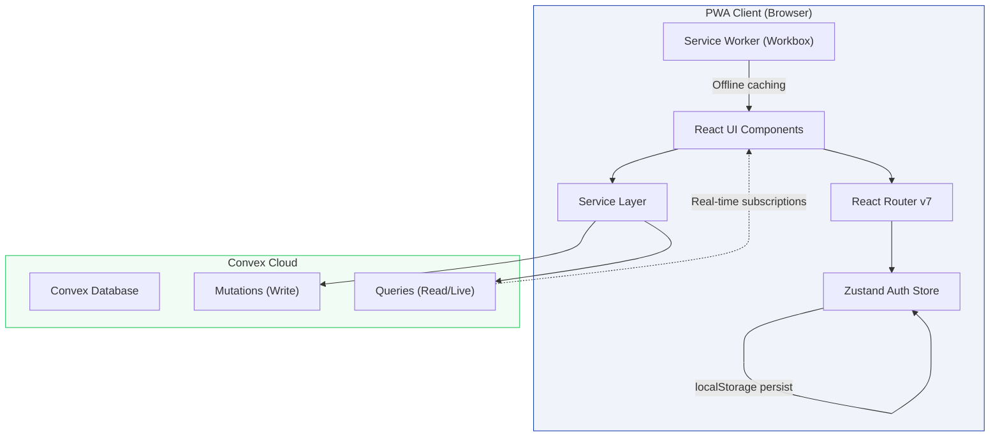
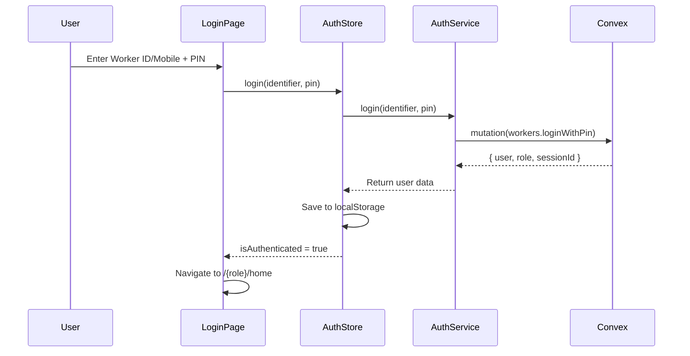
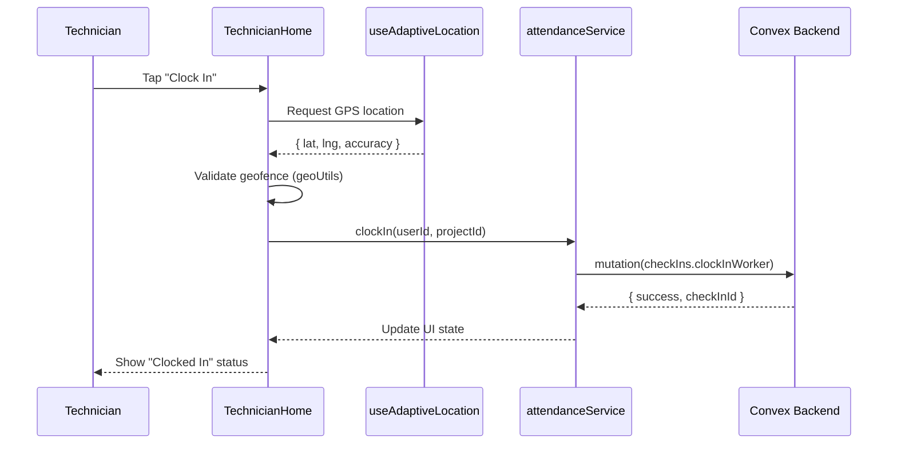
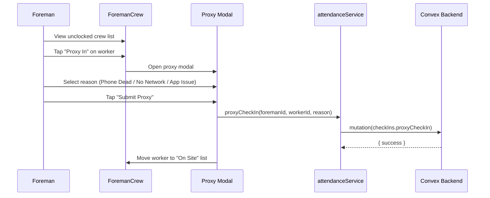
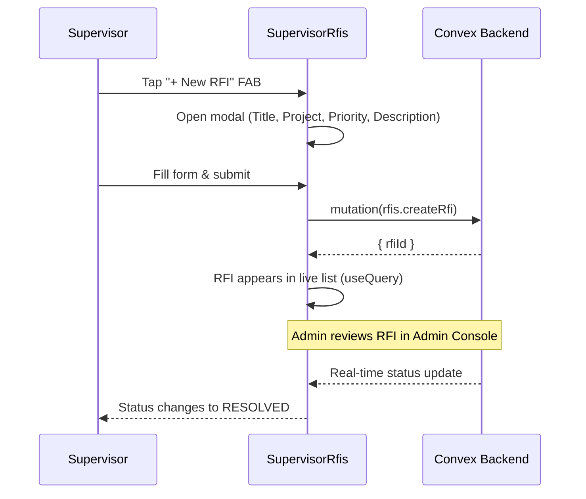
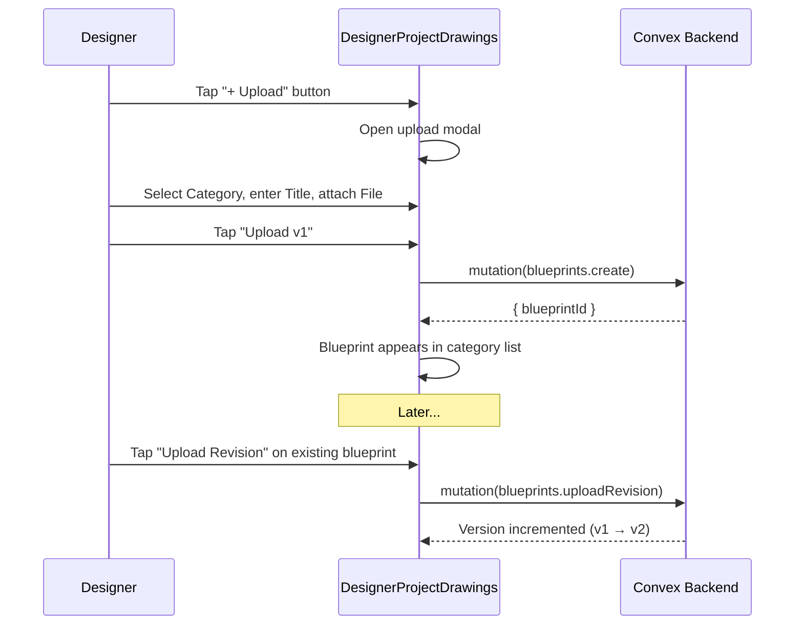

# MEPac PWA — Codebase Documentation

> **MEPac** (MEP Access & Control) is a mobile-first Progressive Web App for field workforce management in MEP (Mechanical, Electrical, Plumbing) construction projects. It enables technicians, foremen, supervisors, and designers to manage attendance, projects, RFIs, disputes, and blueprints from any device.

---

## Table of Contents

1. [Technology Stack](#1-technology-stack)
2. [Project Structure](#2-project-structure)
3. [Architecture Overview](#3-architecture-overview)
4. [Application Bootstrap](#4-application-bootstrap)
5. [Authentication & Session Management](#5-authentication--session-management)
6. [Role-Based Routing & Access Control](#6-role-based-routing--access-control)
7. [User Roles & Features](#7-user-roles--features)
8. [Backend Services (Convex)](#8-backend-services-convex)
9. [State Management](#9-state-management)
10. [Design System](#10-design-system)
11. [PWA Configuration](#11-pwa-configuration)
12. [Build & Deployment](#12-build--deployment)
13. [Workflow Diagrams](#13-workflow-diagrams)

---

## 1. Technology Stack

| Layer | Technology | Version | Purpose |
|---|---|---|---|
| **UI Framework** | React | 19.x | Component-based UI rendering |
| **Routing** | React Router DOM | 7.x | Client-side navigation & nested layouts |
| **State Management** | Zustand | 5.x | Lightweight global auth state with localStorage persistence |
| **Backend / BaaS** | Convex | 1.45 | Real-time database, serverless functions, live queries |
| **Build Tool** | Vite | 8.x | Dev server with HMR & production bundling |
| **Styling** | TailwindCSS | 3.4 | Utility-first CSS with custom design tokens |
| **Icons** | Lucide React | 1.26 | SVG icon library |
| **PWA** | vite-plugin-pwa | 1.3 | Service worker generation, manifest, Workbox caching |
| **Linting** | Oxlint | 1.71 | JavaScript linter |
| **Deployment** | Vercel | — | SPA hosting with client-side route rewrites |

---

## 2. Project Structure

```
mepac-pwa/
├── index.html                    # SPA entry point
├── package.json                  # Dependencies & scripts
├── vite.config.js                # Vite + PWA + chunking config
├── tailwind.config.js            # Design tokens (colors, fonts, spacing)
├── postcss.config.js             # PostCSS with Tailwind & Autoprefixer
├── vercel.json                   # Vercel SPA rewrite rules
├── docs/
│   └── CODEBASE_DOCUMENTATION.md # This file
├── public/                       # Static assets (PWA icons, favicon)
│
└── src/
    ├── main.jsx                  # App bootstrap (React root, providers)
    ├── App.jsx                   # Root component (route definitions + ErrorBoundary)
    ├── convex.js                 # Convex client initialization
    ├── index.css                 # Global CSS + Tailwind directives
    │
    ├── components/               # Shared reusable UI components
    │   ├── BottomNav.jsx         #   Floating pill-shaped mobile navbar
    │   ├── Button.jsx            #   Styled button (primary/secondary/danger)
    │   ├── Card.jsx              #   Container card with border & shadow
    │   ├── Input.jsx             #   Labeled text input
    │   ├── Select.jsx            #   Custom dropdown select
    │   ├── PinInput.jsx          #   6-digit PIN entry with auto-focus
    │   ├── ErrorBoundary.jsx     #   React error boundary wrapper
    │   ├── GoogleSignInButton.jsx#   Google OAuth sign-in trigger
    │   ├── NotificationBellButton.jsx  # Bell icon + unread badge
    │   ├── NotificationDrawer.jsx      # Slide-in notification panel
    │   ├── PushNotificationListener.jsx# Convex → browser notification bridge
    │   └── SessionEnforcerModal.jsx    # Single-device session enforcement
    │
    ├── layouts/                  # Role-specific shell layouts
    │   ├── TechnicianLayout.jsx
    │   ├── ForemanLayout.jsx
    │   ├── SupervisorLayout.jsx
    │   └── DesignerLayout.jsx
    │
    ├── pages/                    # Page-level components (by role)
    │   ├── LoginPage.jsx         #   Shared login (Worker ID/Mobile + PIN)
    │   ├── AcceptInvite.jsx      #   Invitation acceptance flow
    │   ├── PinSetup.jsx          #   First-time PIN creation
    │   ├── technician/           #   Home, Calendar, Account, Profile, ChangePin
    │   ├── foreman/              #   Home, Crew, Calendar, Account, Profile, ChangePin
    │   ├── supervisor/           #   Home, Projects, ProjectDetail, RFIs, Account, Profile, ChangePin
    │   └── designer/             #   Projects, ProjectDrawings, Account, Profile, ChangePin
    │
    ├── routes/
    │   └── ProtectedRoute.jsx    # Auth + role guard wrapper
    │
    ├── services/                 # API service layer (Convex mutations/queries)
    │   ├── authService.js        #   Login, logout, PIN change, session claim
    │   ├── attendanceService.js  #   Clock-in/out, crew attendance, proxy check-in
    │   ├── jobService.js         #   Projects & job assignments
    │   └── pushNotificationService.js  # Browser Notifications API bridge
    │
    ├── store/
    │   └── authStore.js          # Zustand auth store (user, role, session)
    │
    ├── hooks/
    │   └── useAdaptiveLocation.js# Geolocation hook with GPS fallback
    │
    └── utils/
        ├── colors.js             # Project gradient color utilities
        └── geoUtils.js           # Geofencing & distance calculations
```

---

## 3. Architecture Overview



### Key Architectural Decisions

| Decision | Rationale |
|---|---|
| **Convex as BaaS** | Real-time subscriptions, serverless functions, managed database — no custom backend needed |
| **Zustand over Redux** | Minimal boilerplate for auth-only global state |
| **Role-based nested routing** | Each role gets its own layout shell and route group, enforced by `ProtectedRoute` |
| **Service layer abstraction** | All Convex API calls are wrapped in service functions, isolating backend coupling from UI |
| **PWA with Workbox** | Enables install-to-homescreen, offline caching, and push notifications for field workers |
| **Single-device session enforcement** | One active login per worker across devices — critical for attendance integrity |

---

## 4. Application Bootstrap

The app mounts with three nested providers in `main.jsx`:

```
StrictMode
  └── ConvexProvider (real-time backend client)
       └── BrowserRouter (client-side routing)
            └── App (route definitions)
```

The Convex client is initialized in `convex.js`, pointing to the cloud deployment URL (configured via `VITE_CONVEX_URL` env var). It uses `anyApi` for dynamic function references without codegen.

---

## 5. Authentication & Session Management

### Login Flow



### Session Persistence

- Auth state persists to `localStorage` under key `mepac_auth_session`
- On reload, `authStore` reads from localStorage to restore the session
- Each device generates a unique `mepac_device_session_id` for session tracking

### Single-Device Enforcement

`SessionEnforcerModal` subscribes to `workers.getActiveSession` (real-time Convex query), compares the server's `currentSessionId` with the local device ID, and shows a blocking modal with **Reclaim** or **Logout** options when they differ.

---

## 6. Role-Based Routing & Access Control

### Route Map

| Route Pattern | Role | Layout | Pages |
|---|---|---|---|
| `/login` | Public | — | Login |
| `/accept-invite` | Public | — | Accept Invite |
| `/technician/*` | `technician` | TechnicianLayout | Home, Calendar, Account, Profile, Change PIN |
| `/foreman/*` | `foreman` | ForemanLayout | Home, Crew, Calendar, Account, Profile, Change PIN |
| `/supervisor/*` | `supervisor` | SupervisorLayout | Home, Projects, Project Detail, RFIs, Account, Profile, Change PIN |
| `/designer/*` | `designer` | DesignerLayout | Projects, Project Drawings, Account, Profile, Change PIN |
| `*` (catch-all) | — | — | Redirect to `/login` |

### Route Protection

`ProtectedRoute` guards each role group:
- **Not authenticated** → Redirect to `/login`
- **Wrong role** → Redirect to `/{actualRole}/home`
- **Authorized** → Render children (layout + page)

### Layout Pattern

Each role layout follows the same structure: a full-height container with a `<main>` area rendering page content via `<Outlet />`, and a floating pill-shaped `<BottomNav>` at the bottom.

---

## 7. User Roles & Features

### Technician (`/technician/*`)

| Page | Key Features |
|---|---|
| **Home** | GPS-geofenced clock-in/out, active job card, daily task list, weather widget |
| **Calendar** | Monthly attendance calendar with day-by-day records |
| **Account** | Settings menu (profile, change PIN, logout) |
| **Profile** | View/edit personal details |
| **Change PIN** | Old PIN → New PIN → Confirm flow |

**Bottom Nav**: Home · Calendar · Account

---

### Foreman (`/foreman/*`)

| Page | Key Features |
|---|---|
| **Home** | GPS clock-in/out, crew overview, daily toolbox talk, task list |
| **Crew** | Crew attendance list, audited proxy check-in modal with reason selection |
| **Calendar** | Monthly attendance calendar |
| **Account** | Settings menu |
| **Profile** | View/edit personal details |
| **Change PIN** | PIN change flow |

**Bottom Nav**: Home · Crew · Calendar · Account

---

### Supervisor (`/supervisor/*`)

| Page | Key Features |
|---|---|
| **Home** | Dashboard KPIs, project overview, crew stats, daily summary |
| **Projects** | Project list with status filters and search |
| **Project Detail** | Detailed project view with crew, tasks, and progress |
| **RFIs & Disputes** | RFI/Dispute hub with filters, threaded messages, dispute audit trail |
| **Account** | Settings menu |
| **Profile** | View/edit personal details |
| **Change PIN** | PIN change flow |

**Bottom Nav**: Home · Projects · RFIs · Account

---

### Designer (`/designer/*`)

| Page | Key Features |
|---|---|
| **Projects** | Assigned project list with gradient cards |
| **Project Drawings** | Blueprint manager — upload, revise, delete, version history |
| **Account** | Settings menu |
| **Profile** | View/edit personal details |
| **Change PIN** | PIN change flow |

**Bottom Nav**: Projects · Account

---

## 8. Backend Services (Convex)

All backend communication goes through the service layer in `src/services/`.

### Service Layer

| Service | Convex Endpoints |
|---|---|
| **Auth** | `workers.loginWithPin`, `workers.changePin`, `workers.claimSession` |
| **Attendance** | `checkIns.getTodayStatus`, `checkIns.clockInWorker`, `checkIns.clockOutWorker`, `checkIns.getMonthlyAttendance`, `checkIns.getCrewAttendance`, `checkIns.proxyCheckIn` |
| **Jobs/Projects** | `projects.getActiveJobForWorker`, `projects.getSupervisorProjects` |
| **Push Notifications** | Browser Notifications API + Service Worker bridge |

### Real-Time Queries

Some components use `useQuery()` from `convex/react` directly for live subscriptions:

| Component | Query | Purpose |
|---|---|---|
| `SessionEnforcerModal` | `workers.getActiveSession` | Live session monitoring |
| `SupervisorRfis` | `rfis.list` | Real-time RFI list |
| `DesignerProjectDrawings` | `blueprints.*` | Live blueprint data |
| `NotificationDrawer` | `notifications.getForWorker` | Real-time notification feed |

---

## 9. State Management

The app uses a single Zustand store (`authStore.js`) for cross-cutting auth state. All component-level state (form inputs, modals, filters) uses React `useState` hooks.

**Auth Store Shape:**

| Field | Type | Description |
|---|---|---|
| `user` | `object \| null` | Current authenticated user |
| `role` | `string \| null` | User's role (`technician`, `foreman`, `supervisor`, `designer`) |
| `isAuthenticated` | `boolean` | Whether a session is active |
| `isLoading` | `boolean` | Loading state during auth operations |
| `error` | `string \| null` | Last auth error message |

**Actions:** `login(phone, pin, force?)`, `logout()`, `updateUser(updates)`, `clearError()`

**Persistence:** `localStorage` key `mepac_auth_session`

---

## 10. Design System

Defined in `tailwind.config.js`:

### Color Palette

| Token | Value | Usage |
|---|---|---|
| `primary` | `#1E40AF` | Primary buttons, active states, links |
| `primary-light` | `#3B82F6` | Hover states, lighter accents |
| `primary-dark` | `#00288E` | Bottom nav active tab background |
| `accent` | `#FF6B35` | Call-to-action highlights |
| `success` | `#22C55E` | Positive states (clocked in, resolved) |
| `warning` | `#F59E0B` | Caution states |
| `error` | `#EF4444` | Error states, disputes, high priority |
| `surface` | `#F8FAFC` | Page background |
| `surface-card` | `#FFFFFF` | Card backgrounds |
| `text-primary` | `#0B1C30` | Main body text |
| `text-secondary` | `#444653` | Supporting text |
| `text-muted` | `#6B7280` | Hint / placeholder text |

### Typography

| Token | Font Stack |
|---|---|
| `font-sans` | Inter, system-ui |
| `font-heading` | IBM Plex Sans, system-ui |
| `font-mono` | JetBrains Mono, ui-monospace |

---

## 11. PWA Configuration

Configured in `vite.config.js` using `vite-plugin-pwa`:

| Feature | Setting |
|---|---|
| **App Name** | MEPac — Field Workforce Management |
| **Display Mode** | `standalone` (full-screen, no browser chrome) |
| **Theme Color** | `#1E3A5F` |
| **Register Type** | `autoUpdate` (service worker auto-updates on new deployments) |
| **Offline Caching** | JS, CSS, HTML, images, fonts via Workbox `globPatterns` |
| **Font Caching** | Google Fonts cached for 1 year with `CacheFirst` strategy |

### Build Optimization

Manual chunking splits vendor code into four bundles:
- `vendor-react` — React, React DOM, React Router
- `vendor-convex` — Convex client
- `vendor-icons` — Lucide React icons
- `vendor-libs` — All other node_modules

### Push Notifications

The `PushNotificationListener` component (mounted globally in `App.jsx`) subscribes to Convex notification queries and triggers browser notifications for new items. It uses the Service Worker route (`registration.showNotification()`) for mobile PWA, with a fallback to `new Notification()` for desktop browsers.

---

## 12. Build & Deployment

### Development

```bash
npm run dev          # Start Vite dev server (http://localhost:5174)
npm run lint         # Run Oxlint
```

### Production

```bash
npm run build        # Build to /dist (includes service worker generation)
npm run preview      # Preview production build locally
```

### Deployment

Deployed to Vercel with SPA rewrites — all routes rewrite to `index.html`, allowing React Router to handle client-side navigation.

---

## 13. Workflow Diagrams

### Technician Clock-In Flow



### Foreman Proxy Check-In Flow



### Supervisor RFI Flow



### Designer Blueprint Upload Flow



---

> [!TIP]
> **Adding a new role or page:**
> 1. Create a layout in `src/layouts/`
> 2. Create page components in `src/pages/{roleName}/`
> 3. Add routes in `App.jsx` wrapped with `<ProtectedRoute role="newRole">`
> 4. Update `ProtectedRoute.jsx` if needed for new role validation
